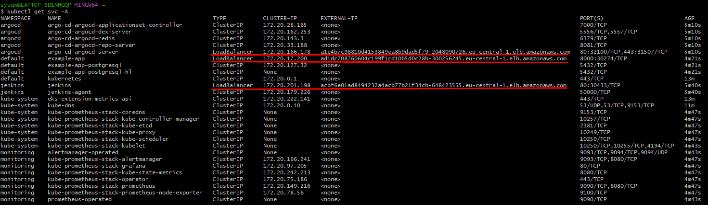
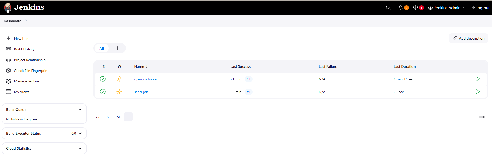
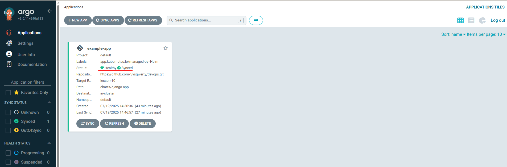
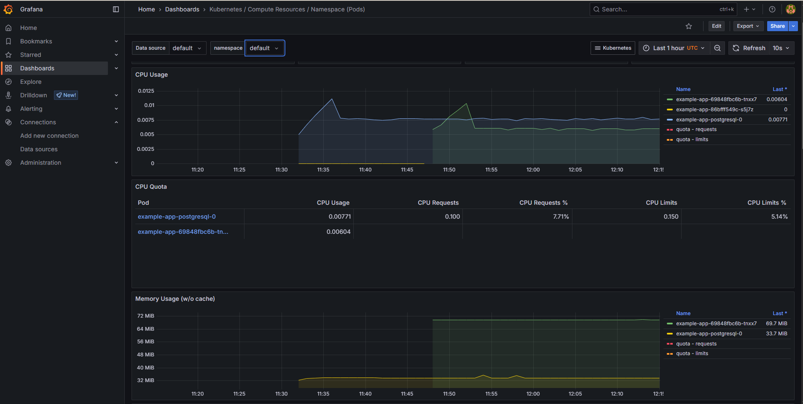

# Project goal

Build and deploy a complete DevOps infrastructure on AWS using Terraform, including the following components:

- Deploy a Kubernetes cluster (EKS) with CI/CD support
- Integrate Jenkins to automate build and deployment
- Install Argo CD for application management
- Configure a database (RDS or Aurora)
- Organize a container registry (ECR)
- Monitoring with Prometheus and Grafana

# Table of contents

- [Technical Details](#technical-details)
- [Architecture Overview](#architecture-overview)
- [Security Configuration](#security-configuration)
- [Prerequisites](#prerequisites)
- [Set up the environment](#set-up-the-environment)
- [Deploy application](#deploy-application)
- [Access URLs and Credentials](#access-urls-and-credentials)
- [Autoscaling Configuration](#autoscaling-configuration)
- [Monitoring](#monitoring)
- [Troubleshooting](#troubleshooting)
- [Destroy the environment](#destroy-the-environment)

## Technical Details

`Infrastructure`: AWS using Terraform

`Components`: VPC, EKS, RDS, ECR, Jenkins, Argo CD, Prometheus, Grafana

## Architecture Overview

This infrastructure implements a complete CI/CD pipeline on AWS with Kubernetes orchestration. The architecture follows best practices for security, scalability, and high availability.

### Architecture Diagram

```
┌─────────────────────────────────────────────────────────────────┐
│                         AWS Cloud (eu-central-1)                │
│                                                                 │
│  ┌──────────────────────────────────────────────────────────┐   │
│  │                      VPC (10.0.0.0/16)                   │   │
│  │                                                          │   │
│  │  ┌──────────────────┐         ┌──────────────────┐       │   │
│  │  │  Public Subnets  │         │ Private Subnets  │       │   │
│  │  │  (10.0.1-3.0/24) │         │ (10.0.4-6.0/24)  │       │   │
│  │  │                  │         │                  │       │   │
│  │  │  ┌────────────┐  │         │  ┌────────────┐  │       │   │
│  │  │  │ EKS API    │  │         │  │ EKS Nodes  │  │       │   │
│  │  │  │ Endpoint   │  │         │  │ (t2.medium)│  │       │   │
│  │  │  └────────────┘  │         │  │ 2-4 nodes  │  │       │   │
│  │  │                  │         │  └────────────┘  │       │   │
│  │  │  ┌────────────┐  │         │                  │       │   │
│  │  │  │ Load       │  │         │  ┌────────────┐  │       │   │
│  │  │  │ Balancers  │  │         │  │ RDS Aurora │  │       │   │
│  │  │  │ (Jenkins,  │  │         │  │ PostgreSQL │  │       │   │
│  │  │  │  ArgoCD)   │  │         │  │ Multi-AZ   │  │       │   │
│  │  │  └────────────┘  │         │  └────────────┘  │       │   │
│  │  └──────────────────┘         └──────────────────┘       │   │
│  │                                                          │   │
│  │  ┌────────────────────────────────────────────────────┐  │   │
│  │  │              Kubernetes Cluster (EKS)              │  │   │
│  │  │                                                    │  │   │
│  │  │  ┌──────────┐  ┌──────────┐  ┌──────────────┐      │  │   │
│  │  │  │ Jenkins  │  │ Argo CD  │  │ Monitoring   │      │  │   │
│  │  │  │ (CI/CD)  │  │ (GitOps) │  │ (Prometheus/ │      │  │   │
│  │  │  │          │  │          │  │  Grafana)    │      │  │   │
│  │  │  └──────────┘  └──────────┘  └──────────────┘      │  │   │
│  │  │                                                    │  │   │
│  │  │  ┌──────────────────────────────────────────────┐  │  │   │
│  │  │  │         Django Application                   │  │  │   │
│  │  │  │  - Deployment with HPA (1-3 replicas)        │  │  │   │
│  │  │  │  - Resource requests/limits                  │  │  │   │
│  │  │  │  - ConfigMap for environment variables       │  │  │   │
│  │  │  └──────────────────────────────────────────────┘  │  │   │
│  │  └────────────────────────────────────────────────────┘  │   │
│  └──────────────────────────────────────────────────────────┘   │
│                                                                 │
│  ┌──────────────────┐         ┌──────────────────┐              │
│  │  ECR Repository  │         │  S3 Backend       │             │
│  │  (Docker Images) │         │  (Terraform State)│             │
│  └──────────────────┘         └──────────────────┘              │
│                                                                 │
└─────────────────────────────────────────────────────────────────┘
         │                    │
         │                    │
    ┌────▼────┐          ┌────▼────┐
    │ GitHub  │          │ Internet│
    │  Repo   │          │ Gateway │
    └─────────┘          └─────────┘
```

### Component Flow

1. **CI/CD Pipeline**:
   - Developer pushes code to GitHub
   - Jenkins detects changes and triggers build
   - Jenkins builds Docker image and pushes to ECR
   - Jenkins updates Helm chart version in Git
   - Argo CD detects Git changes and syncs application

2. **Application Deployment**:
   - Argo CD monitors Git repository (`charts/django-app`)
   - On changes, Argo CD applies Helm chart to EKS cluster
   - Kubernetes HPA monitors CPU usage and scales pods (1-3 replicas)
   - Application connects to RDS Aurora database

3. **Monitoring**:
   - Prometheus scrapes metrics from Kubernetes components
   - Grafana visualizes metrics in dashboards
   - HPA uses metrics server for autoscaling decisions

## Security Configuration

### VPC Configuration

The infrastructure uses a secure VPC setup with network isolation:

- **VPC CIDR**: `10.0.0.0/16`
- **Public Subnets**: `10.0.1.0/24`, `10.0.2.0/24`, `10.0.3.0/24` (across 3 AZs)
  - Used for: EKS API endpoint, Load Balancers, Internet Gateway
  - Auto-assigns public IP addresses
- **Private Subnets**: `10.0.4.0/24`, `10.0.5.0/24`, `10.0.6.0/24` (across 3 AZs)
  - Used for: EKS worker nodes, RDS database
  - No direct internet access
- **DNS Support**: Enabled for both DNS support and hostnames
- **Internet Gateway**: Attached for public subnet internet access
- **NAT Instance**: Configured for private subnet outbound internet access

### Security Groups

#### RDS Security Group
- **Name**: `{name}-sg`
- **Ingress Rules**:
  - Port 5432 (PostgreSQL) from VPC CIDR only (if not publicly accessible)
  - Port 5432 from 0.0.0.0/0 (if publicly accessible - not recommended for production)
- **Egress Rules**: All traffic allowed (0.0.0.0/0)

#### NAT Instance Security Group
- **Name**: `{name}-nat-sg`
- **Ingress Rules**: All traffic from VPC CIDR (10.0.0.0/16)
- **Egress Rules**: All traffic to internet (0.0.0.0/0)

#### EKS Security Groups
- Managed by AWS EKS service
- Automatically configured for cluster communication
- Worker nodes can communicate with control plane
- Load balancers have appropriate security group rules

### IAM Roles and Policies

#### EKS Cluster Role
- **Role Name**: `{cluster_name}-eks-cluster`
- **Policies Attached**:
  - `AmazonEKSClusterPolicy` - Allows EKS to manage cluster resources
- **Trust Relationship**: `eks.amazonaws.com` service

#### EKS Worker Node Role
- **Role Name**: `{cluster_name}-nodes`
- **Policies Attached**:
  - `AmazonEKSWorkerNodePolicy` - Allows nodes to join EKS cluster
  - `AmazonEKS_CNI_Policy` - Allows VPC CNI plugin to manage networking
  - `AmazonEC2ContainerRegistryReadOnly` - Allows pulling images from ECR
- **Trust Relationship**: `ec2.amazonaws.com` service

#### EBS CSI Driver Role (IRSA)
- **Role Name**: `{cluster_name}-ebs-csi-irsa-role`
- **Policies Attached**:
  - `AmazonEBSCSIDriverPolicy` - Allows EBS volume management
- **Trust Relationship**: OIDC provider (IRSA - IAM Roles for Service Accounts)
- **Service Account**: `kube-system:ebs-csi-controller-sa`

#### Jenkins Kaniko Role (IRSA)
- **Role Name**: `{cluster_name}-jenkins-kaniko-role`
- **Policies**:
  - Custom policy for ECR operations:
    - `ecr:GetAuthorizationToken`
    - `ecr:BatchCheckLayerAvailability`
    - `ecr:PutImage`
    - `ecr:InitiateLayerUpload`
    - `ecr:UploadLayerPart`
    - `ecr:CompleteLayerUpload`
    - `ecr:DescribeRepositories`
- **Trust Relationship**: OIDC provider
- **Service Account**: `jenkins:jenkins-sa`

#### NAT Instance Role
- **Role Name**: `{name}-ec2-role-nat`
- **Policies Attached**:
  - `AmazonSSMManagedInstanceCore` - Allows SSM access for management
- **Trust Relationship**: `ec2.amazonaws.com` service

### Security Best Practices Implemented

1. **Network Isolation**: Private subnets for sensitive resources (RDS, worker nodes)
2. **Least Privilege IAM**: Each role has only necessary permissions
3. **IRSA (IAM Roles for Service Accounts)**: Kubernetes pods use IAM roles without storing credentials
4. **RDS Security**: Database in private subnets, restricted security group access
5. **EKS Endpoint Access**: Both private and public access enabled for flexibility
6. **Encryption**: ECR image scanning enabled (`scan_on_push = true`)
7. **Multi-AZ Deployment**: RDS Aurora configured with Multi-AZ for high availability

## Prerequisites

- AWS CLI installed and configured
- kubectl installed
- Helm installed
- Docker installed
- Terraform installed

### Configuration File Setup

Before deploying, you need to create a `terraform.tfvars` file with your specific configuration values.

1. **Copy the example file**:
   ```bash
   cp terraform.tfvars.example terraform.tfvars
   ```

2. **Edit `terraform.tfvars`** with your values:
   - Replace `<github_username>`, `<project_name>`, and other placeholders
   - Set a secure `rds_password` (required)
   - Generate a GitHub Personal Access Token (PAT) at https://github.com/settings/tokens
   - Ensure `bucket_name` is globally unique (S3 bucket names must be unique)
   - Customize other settings as needed

3. **Important variables to configure**:
   - `github_pat`: GitHub Personal Access Token with `repo` scope
   - `rds_password`: Strong password for the RDS database
   - `bucket_name`: Must be globally unique (S3 bucket naming requirement)
   - `github_repo_url`: Your repository URL
   - `github_user`: Your GitHub username
   - `github_branch`: Branch for Jenkins and Argo CD (e.g., `main`, `develop`)

**Note**: The `terraform.tfvars` file contains sensitive information (passwords, tokens) and should **never** be committed to version control. It's already included in `.gitignore` to prevent accidental commits.

See `terraform.tfvars.example` for a complete list of available configuration options with descriptions.

## Set up the environment

For this task, we will use an EKS cluster in the `eu-central-1` region.

### Initial Setup: S3 Backend Configuration

**Important**: If this is your first deployment and the S3 backend bucket doesn't exist yet, you need to create it first before using it as a Terraform backend.

#### Step 1: Comment Out Backend Block

Temporarily comment out the backend configuration in `backend.tf` to allow Terraform to create the S3 bucket and DynamoDB table:

```terraform
# terraform {
#   backend "s3" {
#     bucket         = "terraform-state-bucket-18062025214500-ira"
#     key            = "terraform.tfstate"
#     region         = "eu-central-1"
#     dynamodb_table = "terraform-locks"
#     encrypt        = true
#   }
# }
```

#### Step 2: Create S3 Backend Resources

Apply Terraform to create only the S3 backend resources:

```sh
terraform init
terraform apply -target=module.s3_backend
```

This creates:
- S3 bucket for Terraform state storage
- DynamoDB table for state locking

#### Step 3: Uncomment Backend Block

Uncomment the backend block in `backend.tf`:

```terraform
terraform {
  backend "s3" {
    bucket         = "terraform-state-bucket-18062025214500-ira"
    key            = "terraform.tfstate"
    region         = "eu-central-1"
    dynamodb_table = "terraform-locks"
    encrypt        = true
  }
}
```

#### Step 4: Migrate State to S3

Migrate your local Terraform state to the S3 backend:

```sh
terraform init -migrate-state
```

When prompted, type `yes` to confirm the migration.

#### Step 5: Deploy Full Infrastructure

Now you can deploy the complete infrastructure:

```sh
terraform plan
terraform apply
```

**Note**: After the initial setup, you can use `terraform init`, `terraform plan`, and `terraform apply` normally. The backend will already exist and Terraform will use it automatically.

## Deploy application

Now that the environment is set up, you can proceed with the rest of the tasks.

Connect kubectl to your cluster:
```sh
aws eks update-kubeconfig --region eu-central-1 --name <your_cluster_name>
```

Check the services in the cluster:
```sh
kubectl get svc -A
```

URL to created resources can be found in LoadBalancer URL.

Example:


Open Jenkins LoadBalancer URL (username: admin; password: admin123)
- Run the `seed-job` job (that will create new job `django-docker`)
- Run the `django-docker` job

Second job will:
- Build and push Docker image to ECR
- Merge MR in your repo with updating the app version (according to the Jenkins `django-docker` job build number)



Open Argo CD LoadBalancer URL
- check the status of `example-app` application (should be `Healthy` and `Synced`)



## Access URLs and Credentials

### Finding Service URLs

After deployment, retrieve the LoadBalancer URLs using:

```bash
# Get all LoadBalancer services
kubectl get svc -A | grep LoadBalancer

# Get Jenkins URL
kubectl get svc -n jenkins jenkins -o jsonpath='{.status.loadBalancer.ingress[0].hostname}'

# Get Argo CD URL
kubectl get svc -n argocd argocd-server -o jsonpath='{.status.loadBalancer.ingress[0].hostname}'

# Get Django App URL (if LoadBalancer type)
kubectl get svc -n default <app-name> -o jsonpath='{.status.loadBalancer.ingress[0].hostname}'
```

### Jenkins Access

- **URL**: `http://<jenkins-loadbalancer-url>`
- **Username**: `admin`
- **Password**: `admin123`
- **Initial Setup**:
  1. Run the `seed-job` job (creates `django-docker` job)
  2. Run the `django-docker` job to build and deploy

### Argo CD Access

- **URL**: `https://<argocd-loadbalancer-url>` (or `http://` if HTTPS not configured)
- **Username**: `admin`
- **Password**: Retrieve using:
  ```bash
  kubectl -n argocd get secret argocd-initial-admin-secret -o jsonpath="{.data.password}" | base64 -d
  ```
- **Application**: `example-app` (should show `Healthy` and `Synced` status)

### Grafana Access

- **URL**: `http://localhost:3000` (after port forwarding)
- **Username**: `admin`
- **Password**: Retrieve using:
  ```bash
  kubectl get secret --namespace monitoring kube-prometheus-stack-grafana -o jsonpath="{.data.admin-password}" | base64 --decode
  ```
- **Port Forward Command**:
  ```bash
  kubectl port-forward -n monitoring svc/kube-prometheus-stack-grafana 3000:80
  ```

### RDS Database Access

- **Endpoint**: Available in Terraform outputs:
  ```bash
  terraform output rds_endpoint
  ```
- **Port**: `5432`
- **Database Name**: `myapp` (default, configurable via `rds_database_name`)
- **Username**: `postgres` (default, configurable via `rds_username`)
- **Password**: Set in `terraform.tfvars` (`rds_password`)
- **Connection**: Only accessible from within VPC (if `rds_publicly_accessible = false`)

### ECR Repository

- **Repository URL**: Available in Terraform outputs:
  ```bash
  terraform output ecr_repository_url
  ```
- **Format**: `<account-id>.dkr.ecr.<region>.amazonaws.com/<repository-name>`
- **Authentication**:
  ```bash
  aws ecr get-login-password --region eu-central-1 | docker login --username AWS --password-stdin <ecr-repository-url>
  ```

### EKS Cluster Access

- **Cluster Name**: `{name}-eks` (e.g., `django-app-ira-eks`)
- **Region**: `eu-central-1`
- **Connect Command**:
  ```bash
  aws eks update-kubeconfig --region eu-central-1 --name <cluster-name>
  ```
- **Verify Connection**:
  ```bash
  kubectl get nodes
  kubectl get pods -A
  ```

## Autoscaling Configuration

### Horizontal Pod Autoscaler (HPA)

The Django application uses Kubernetes HPA for automatic scaling based on CPU utilization.

#### HPA Configuration

**File**: `charts/django-app/templates/hpa.yaml`

```yaml
apiVersion: autoscaling/v2
kind: HorizontalPodAutoscaler
spec:
  minReplicas: 1          # Minimum number of pods
  maxReplicas: 3          # Maximum number of pods
  metrics:
    - type: Resource
      resource:
        name: cpu
        target:
          type: Utilization
          averageUtilization: 70  # Target CPU utilization (70%)
  behavior:
    scaleUp:
      stabilizationWindowSeconds: 60  # Wait 60s before scaling up
```

#### Resource Requests and Limits

**File**: `charts/django-app/templates/deployment.yaml`

The deployment includes resource specifications required for HPA to function:

```yaml
resources:
  requests:
    cpu: "100m"        # 0.1 CPU cores
    memory: "128Mi"     # 128 Megabytes
  limits:
    cpu: "500m"        # 0.5 CPU cores
    memory: "512Mi"    # 512 Megabytes
```

**Why these are required**: HPA needs resource requests to calculate CPU utilization percentages. Without requests, HPA shows `<unknown>` for CPU metrics.

#### How HPA Works

1. **Metrics Collection**: Kubernetes Metrics Server collects CPU usage from pods
2. **Target Calculation**: HPA calculates desired replicas based on:
   - Current CPU usage
   - Target utilization (70%)
   - Current number of replicas
3. **Scaling Decision**:
   - If average CPU > 70%: Scale up (add pods)
   - If average CPU < 70%: Scale down (remove pods)
   - Respects min (1) and max (3) replica limits
4. **Stabilization**: 60-second window prevents rapid scaling oscillations

#### Checking HPA Status

```bash
# View HPA status
kubectl get hpa

# Detailed HPA information
kubectl describe hpa <hpa-name>

# View current pod replicas
kubectl get deployment <app-name>
```

#### Expected HPA Output

```
NAME          REFERENCE                TARGETS         MINPODS   MAXPODS   REPLICAS   AGE
example-app   Deployment/example-app   50%/70%         1         3         2         5m
```

- **TARGETS**: Current CPU usage / Target CPU usage
- **REPLICAS**: Current number of running pods

#### EKS Node Group Autoscaling

The EKS cluster also supports node-level autoscaling:

- **Min Nodes**: 2
- **Desired Nodes**: 2
- **Max Nodes**: 4
- **Instance Type**: `t2.medium`

Node autoscaling is managed by the EKS cluster autoscaler (if configured) or manually adjusted.

#### Testing Autoscaling

To test HPA functionality:

```bash
# Generate load on the application
kubectl run -i --tty load-generator --rm --image=busybox --restart=Never -- /bin/sh
# Inside the pod:
while true; do wget -q -O- http://<app-service-name>; done

# In another terminal, watch HPA scale
watch kubectl get hpa

# Watch pods being created
watch kubectl get pods
```

## Monitoring

- forward Grafana port using the next command
- - `kubectl port-forward -n monitoring svc/kube-prometheus-stack-grafana 3000:80`
- open URL http://localhost:3000
- login with username `admin` and password from the next command
- - `kubectl get secret --namespace monitoring kube-prometheus-stack-grafana -o jsonpath="{.data.admin-password}" | base64 --decode`
- check existing dashboards to see the CPU and Memory usage (PODs, Nodes etc.)



## Troubleshooting

### Common Issues and Solutions

#### 1. HPA Shows `<unknown>` for CPU Metrics

**Symptoms**:
```bash
$ kubectl get hpa
NAME          REFERENCE                TARGETS         MINPODS   MAXPODS   REPLICAS   AGE
example-app   Deployment/example-app   <unknown>/70%   1         3         1         5m
```

**Cause**: Deployment lacks resource requests/limits.

**Solution**:
1. Ensure `charts/django-app/templates/deployment.yaml` includes:
   ```yaml
   resources:
     requests:
       cpu: "100m"
       memory: "128Mi"
     limits:
       cpu: "500m"
       memory: "512Mi"
   ```
2. Commit and push changes to Git
3. Argo CD will automatically sync the changes
4. Wait 1-2 minutes for metrics to populate

**Verify Fix**:
```bash
kubectl get hpa
kubectl describe hpa <hpa-name>
```

#### 2. Cannot Connect to EKS Cluster

**Symptoms**:
```
error: unable to connect to server
```

**Solutions**:
```bash
# Verify AWS credentials
aws sts get-caller-identity

# Update kubeconfig
aws eks update-kubeconfig --region eu-central-1 --name <cluster-name>

# Verify cluster access
kubectl get nodes
```

#### 3. Pods Stuck in Pending State

**Symptoms**:
```bash
$ kubectl get pods
NAME                          READY   STATUS    RESTARTS   AGE
example-app-xxx               0/1     Pending   0          5m
```

**Diagnosis**:
```bash
# Check pod events
kubectl describe pod <pod-name>

# Check node resources
kubectl top nodes

# Check node capacity
kubectl describe nodes
```

**Common Causes**:
- **Insufficient resources**: Nodes don't have enough CPU/memory
- **No nodes available**: All nodes are at capacity
- **Node selector mismatch**: Pod has node selectors that don't match any nodes

**Solutions**:
- Scale up EKS node group
- Check resource requests vs node capacity
- Remove node selectors if not needed

#### 4. Argo CD Application Not Syncing

**Symptoms**: Application shows `OutOfSync` or `Degraded` status

**Diagnosis**:
```bash
# Check Argo CD application status
kubectl get application -n argocd

# View application details
argocd app get example-app

# Check application events
kubectl describe application example-app -n argocd
```

**Solutions**:
- Verify Git repository URL and branch are correct
- Check Git credentials in Argo CD
- Ensure Helm chart is valid:
  ```bash
  helm lint charts/django-app
  ```
- Manually sync if needed:
  ```bash
  argocd app sync example-app
  ```

#### 5. Jenkins Cannot Push to ECR

**Symptoms**: Jenkins build fails with ECR authentication errors

**Diagnosis**:
```bash
# Check Jenkins pod logs
kubectl logs -n jenkins <jenkins-pod-name>

# Verify IAM role is attached
kubectl describe sa jenkins-sa -n jenkins
```

**Solutions**:
- Verify Jenkins IAM role has ECR permissions
- Check OIDC provider is configured correctly
- Ensure service account annotation is correct:
  ```yaml
  annotations:
    eks.amazonaws.com/role-arn: <jenkins-role-arn>
  ```

#### 6. RDS Connection Failures

**Symptoms**: Application cannot connect to database

**Diagnosis**:
```bash
# Check application pod logs
kubectl logs <app-pod-name>

# Verify ConfigMap has correct values
kubectl get configmap <app-name>-config -o yaml

# Test RDS connectivity from pod
kubectl run -it --rm debug --image=postgres:15 --restart=Never -- psql -h <rds-endpoint> -U postgres -d myapp
```

**Solutions**:
- Verify RDS endpoint in ConfigMap matches Terraform output
- Check security group allows traffic from EKS nodes (port 5432)
- Verify RDS is in same VPC as EKS
- Check RDS credentials are correct
- Ensure RDS subnet group includes private subnets

#### 7. Metrics Server Not Working

**Symptoms**: `kubectl top` commands fail or HPA can't get metrics

**Diagnosis**:
```bash
# Check metrics server deployment
kubectl get deployment metrics-server -n kube-system

# Check metrics server logs
kubectl logs -n kube-system deployment/metrics-server

# Test metrics API
kubectl get --raw /apis/metrics.k8s.io/v1beta1/nodes
```

**Solutions**:
- Verify metrics server is installed (usually pre-installed in EKS)
- Check metrics server pod is running:
  ```bash
  kubectl get pods -n kube-system | grep metrics-server
  ```
- If missing, install metrics server:
  ```bash
  kubectl apply -f https://github.com/kubernetes-sigs/metrics-server/releases/latest/download/components.yaml
  ```

#### 8. LoadBalancer Stuck in Pending

**Symptoms**: Service shows `EXTERNAL-IP` as `<pending>`

**Diagnosis**:
```bash
# Check service events
kubectl describe svc <service-name>

# Check for LoadBalancer controller
kubectl get pods -n kube-system | grep aws-load-balancer
```

**Solutions**:
- Verify AWS Load Balancer Controller is installed
- Check IAM permissions for Load Balancer Controller
- Ensure subnets have proper tags:
  ```bash
  # Public subnets should have:
  kubernetes.io/role/elb = 1
  ```
- Check security group allows traffic on service port

#### 9. Terraform State Lock Issues

**Symptoms**: `Error acquiring the state lock`

**Solutions**:
```bash
# Check DynamoDB table for locks
aws dynamodb scan --table-name terraform-locks

# Force unlock (use with caution)
terraform force-unlock <lock-id>
```

#### 10. Pod OOMKilled (Out of Memory)

**Symptoms**: Pods restarting with status `OOMKilled`

**Diagnosis**:
```bash
# Check pod status
kubectl get pods
kubectl describe pod <pod-name>
```

**Solutions**:
- Increase memory limits in deployment
- Check application memory usage patterns
- Consider increasing node instance size

### Useful Debugging Commands

```bash
# Cluster overview
kubectl get all -A
kubectl get nodes
kubectl top nodes
kubectl top pods

# Application debugging
kubectl logs <pod-name> -f
kubectl exec -it <pod-name> -- /bin/sh
kubectl describe pod <pod-name>

# Network debugging
kubectl get svc -A
kubectl get ingress -A
kubectl get endpoints

# Storage debugging
kubectl get pv
kubectl get pvc
kubectl describe pvc <pvc-name>

# Argo CD debugging
kubectl get applications -n argocd
argocd app list
argocd app get <app-name>

# Jenkins debugging
kubectl logs -n jenkins <jenkins-pod-name>
kubectl exec -n jenkins <jenkins-pod-name> -- cat /var/jenkins_home/secrets/initialAdminPassword
```

### Getting Help

- Check Terraform outputs: `terraform output`
- Review AWS CloudWatch logs for EKS
- Check Kubernetes events: `kubectl get events -A --sort-by='.lastTimestamp'`
- Review application logs in Grafana
- Check Argo CD logs: `kubectl logs -n argocd -l app.kubernetes.io/name=argocd-server`

## Destroy the environment
```sh
terraform destroy
```